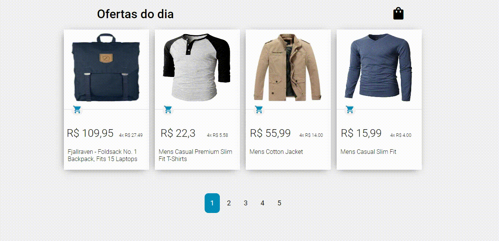

# Site ON 
https://practical-lalande-6a5320.netlify.app/

--
<h1 align="center">
    
</h1>

## Sobre
🛒**mini-lojaVirtual**, objetivo foi treinar JavaScript puro e um pouco de CSS

---

## Tecnologias
🚀
#### JavaScript
#### CSS
#### HTML

---

## Como baixar o projeto

```bash
#Clona repositório
$ git clone https://github.com/edpedro/mini-lojaVirtual.git

#Agora é so usar!!!


```
---

Desenvolvido por Eduardo Pedro, Edp2013.ep@gmail.com